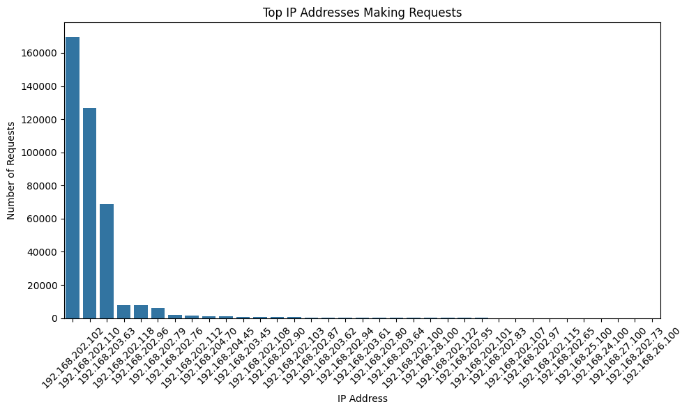
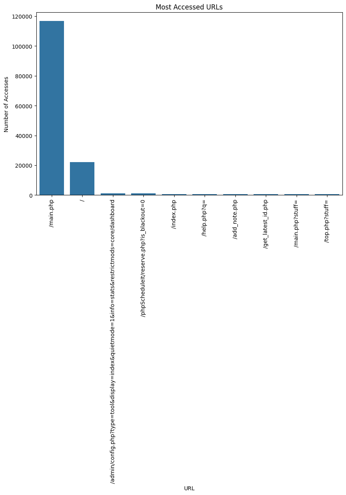
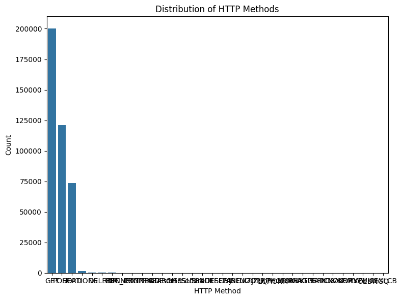
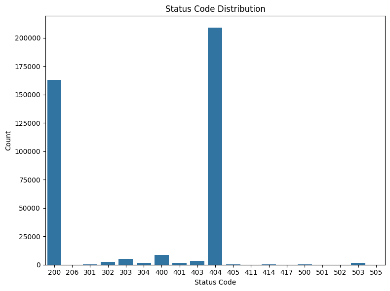
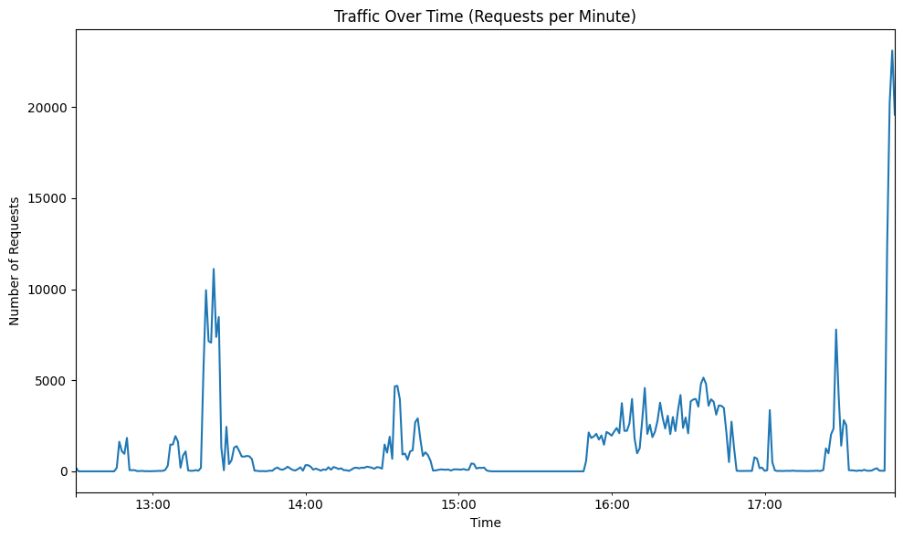

# Live Security Log Analysis Dashboard

This project is a **live log analysis dashboard** built using **Streamlit**. It analyzes logs from a `.log` file, visualizes the data, and provides insights on security events such as:
- **Top IP addresses making requests**
- **Most accessed URLs**
- **HTTP methods distribution**
- **Status code analysis**
- **Traffic patterns over time**

## Dataset Used

Open Source Dataset: [https://www.secrepo.com/http.log](https://www.secrepo.com/maccdc2012/http.log.gz)

## **Dashboard Overview**

The live dashboard provides multiple insights into the log data with several interactive visualizations.

### **1. Top IP Addresses Making Requests**
This plot shows the top IP addresses based on the number of requests made to the server.

### **2. Most Accessed URLs**
This plot displays the most frequently accessed URLs in the log data, giving you insights into which endpoints are most popular.

### **3. HTTP Methods Distribution**
This chart breaks down the distribution of HTTP methods (e.g., GET, POST) used in the requests.

### **4. Status Code Analysis**
The status code analysis shows the distribution of different HTTP status codes, such as `200 OK` and `404 Not Found`.

### **5. Traffic Over Time**
This graph visualizes the traffic patterns, showing the number of requests over time.

